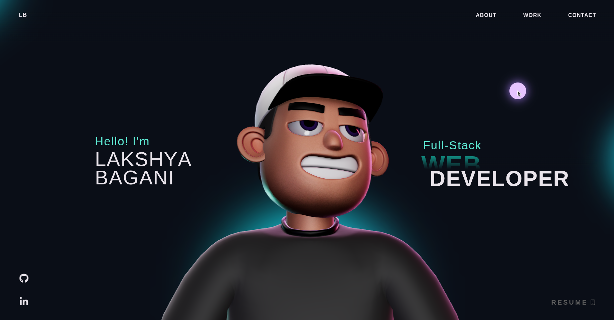

# Lakshya Bagani — 3D Portfolio

A personal portfolio website built with React, TypeScript, Three.js, and GSAP featuring an interactive 3D character, physics-based tech stack visualization, and smooth scroll-driven animations.

## Tech Stack

- **Frontend:** React 18, TypeScript, Vite
- **3D & Animation:** Three.js, React Three Fiber, GSAP, Rapier Physics
- **Styling:** CSS with custom properties

## Features

- Interactive 3D character with mouse-tracking head rotation
- Physics-based tech stack balls with pointer interactions
- GSAP-powered scroll animations and smooth scrolling
- Custom cursor with context-aware states
- Fully responsive across desktop, tablet, and mobile

## Contact

- **Email:** work.lakshyabagani@gmail.com
- **LinkedIn:** [lakshya-bagani](https://www.linkedin.com/in/lakshya-bagani-95741b326/)
- **GitHub:** [LakshyaBagani](https://github.com/LakshyaBagani)

